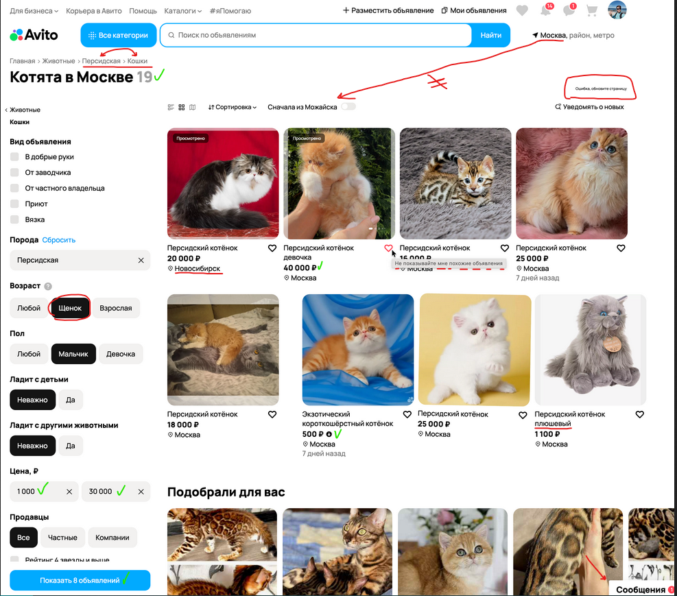

# Test-QA-Avto
Solution to the test task for the QA-Avto
## Как пользоваться этим репозиторием:

Python версия 3.10 и выше

Установите зависимости через cmd:
`pip install -r requirements.txt`

Введите для запуска теста
`pytest -s test_api.py `

Визуальный анализ багов (Задание 1)

